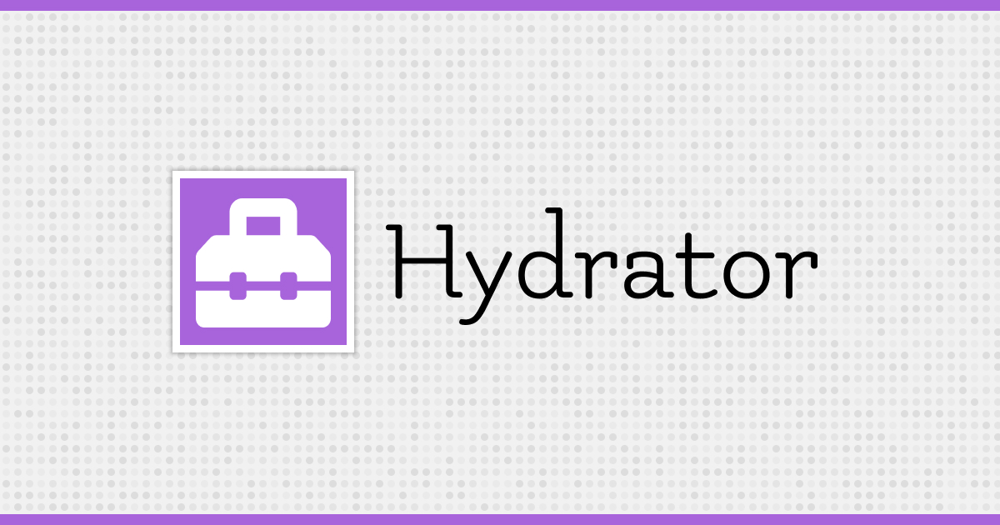

  

# Hydrator


[![Latest Version on Packagist][ico-version]][link-packagist]
[![Software License][ico-license]](LICENSE.md)
[![Build Status][ico-travis]][link-travis]
[![Coverage Status][ico-scrutinizer]][link-scrutinizer]
[![Quality Score][ico-code-quality]][link-code-quality]
[![Total Downloads][ico-downloads]][link-downloads]

Hydrator is a library that can help you populate an Data Object properties from array.  

## Structure

```     
build/
src/
examples/
tests/
vendor/
```

## Install

Via Composer

``` bash
$ composer require gravataLonga/hydrator
```

## Usage

``` php
$properties = ['id' => 1, 'string' => 'hello world']

class Entity implements HydrableInterface
{
    use HydrateTrait;
    
    public int $id;
    
    public string $string;
}

$e = Entity::hydrate($property);
echo $e->id; // 1
echo $e->string; // hello world
```  

You can even use internal functions to format properly value,  

``` php
$properties = ['name' => 'Jonathan']

class Entity implements HydrableInterface
{
    use HydrateTrait;
    
    public string $name;
    
    private function formatName($value)
    {
        return 'Hi, ' . $value;
    }
}

$e = Entity::hydrate($property);
echo $e->string; // Hi, Jonathan  
```

**Note**: If property is set private or protected, it will not populate that fields, and it will
throw an exception.  


If you can't or dislike usage of traits, you have another way, is to use: `Hydrator`.  

```
$hydrator = new Hydrator(['id' => 1]);
$entity = $hydrator->hydrate(new Entity);

echo $entity->id; // 1
```

## Change log

Please see [CHANGELOG](CHANGELOG.md) for more information on what has changed recently.

## Testing

``` bash
$ composer test
```

## Contributing

Please see [CONTRIBUTING](.github/CONTRIBUTING.md) and [CODE_OF_CONDUCT](CODE_OF_CONDUCT.md) for details.

## Security

If you discover any security related issues, please email jonathan.alexey16@gmail.com instead of using the issue tracker.

## Credits

- [Jonathan Fontes][link-author]
- [All Contributors][link-contributors]

## License

The MIT License (MIT). Please see [License File](LICENSE.md) for more information.

[ico-version]: https://img.shields.io/packagist/v/gravataLonga/hydrator.svg?style=flat-square
[ico-license]: https://img.shields.io/badge/license-MIT-brightgreen.svg?style=flat-square
[ico-travis]: https://img.shields.io/travis/gravataLonga/hydrator/master.svg?style=flat-square
[ico-scrutinizer]: https://img.shields.io/scrutinizer/coverage/g/gravataLonga/hydrator.svg?style=flat-square
[ico-code-quality]: https://img.shields.io/scrutinizer/g/gravataLonga/hydrator.svg?style=flat-square
[ico-downloads]: https://img.shields.io/packagist/dt/gravataLonga/hydrator.svg?style=flat-square

[link-packagist]: https://packagist.org/packages/gravataLonga/hydrator
[link-travis]: https://travis-ci.org/gravataLonga/hydrator
[link-scrutinizer]: https://scrutinizer-ci.com/g/gravataLonga/hydrator/code-structure
[link-code-quality]: https://scrutinizer-ci.com/g/gravataLonga/hydrator
[link-downloads]: https://packagist.org/packages/gravataLonga/hydrator
[link-author]: https://github.com/gravataLonga
[link-contributors]: ../../contributors
